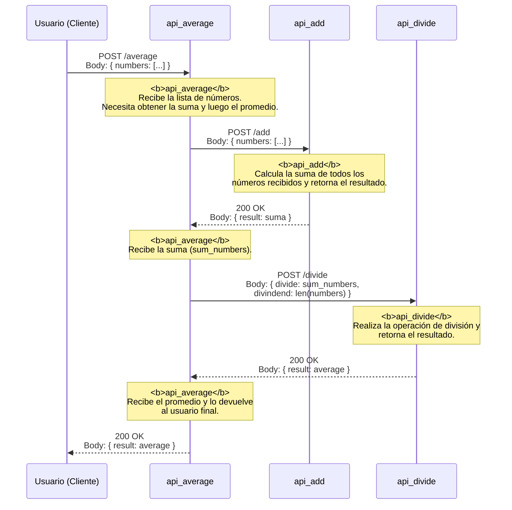

# API Average

Es un proyecto que se encarga de calcular el promedio de una lista de números, por medio de 3 APIs:

- API Add: Se encarga de sumar una lista de números.
- API Divide: Se encarga de dividir un número por otro.
- API Average: Se encarga de calcular el promedio de una lista de números.

El objetivo es que el promedio se pueda calcular de manera distribuida, es decir, que cada API se encargue de su tarea y luego se haga la división, es un enfoque sencillo para poder entender el concepto de microservicios.

## Diagrama de secuencia

