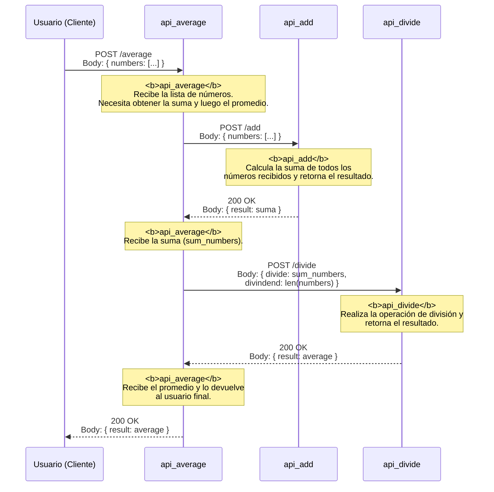

# API Average

El objetivo de este proyecto es visualizar con ayuda de jaeger y opentelemetry la interaccion entre microservicios.

Para ello he creado 3 APIs para poder calcular el promedio de una lista de números, cada API se encarga de una tarea y se comunican entre si para poder obtener el resultado final, todo esto se detona desde la API de Average la cual es la que se encarga de recibir la lista de números y luego calcular el promedio haciendo uso de las otras 2 APIs.

- API Add: Se encarga de sumar una lista de números.
- API Divide: Se encarga de dividir un número por otro.
- API Average: Se encarga de calcular el promedio de una lista de números.


## Diagrama de secuencia




## Ejecutar el proyecto

Primero deberas ejecutar el script `execute_all_apis.py`, este script ejecuta las 3 APIs:
* api_average: 'http://localhost:9001'
* api_add: 'http://localhost:9002'
* api_divide: 'http://localhost:9003'


Ahora deberas correr jaeger en tu local con ayuda de docker-compose:

```
docker-compose up jaeger
```

Finalmente, haz la peticion al servicio: '/average' de la API promedio que se encuentra en: 'http://localhost:9001' para poder desencadenar el flujo de la secuencia y este se pueda ver en jaeger.


Ya  que hiciste lo anterior, deberias ver los datos en jaeger, para ello, puedes visitar la siguiente url:

```
http://localhost:16686/
```
